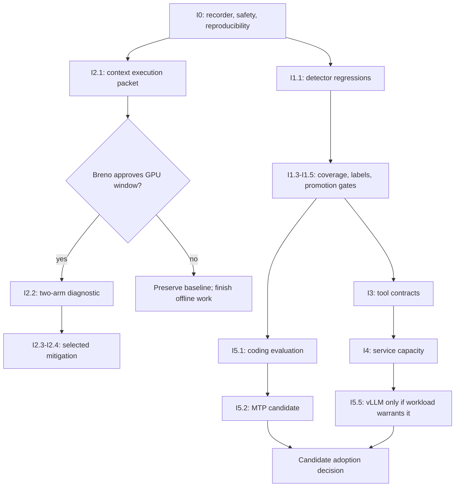

# RTX 5090 improvement implementation plan

**Date:** September 13, 2026.  
**Last updated:** September 17, 2026 (review rounds `llm-bench-30`–`35`; scout consultation `llm-bench-16`).  
**Status:** master implementation backlog. It replaces neither recorded benchmark results nor production approval.  
**Language:** English is normative; the downloaded research reports are preserved Portuguese inputs.

## Purpose

This is the one execution-oriented list of improvements derived from both downloaded deep-research reports, their reviews, and the local benchmark record.

It deliberately treats the reports as an **idea backlog**, not as a source of facts that must be accepted before work can begin. An item can be designed, implemented offline, and tested locally even if its external performance rationale remains unverified. No item may change production merely because a report recommended it: production adoption requires the item's own acceptance evidence and the authorization stated below.

| Input | Role in this plan |
|---|---|
| `deep-research-report-1.md` — SHA-256 `382ded1fb10d0f8de222431ebc5db8099326525d6f8103142de4365723c1eb41` | Original set of implementation ideas |
| `deep-research-report-2.md` — SHA-256 `3917c9043c2f01fd3027701b0b85c8210a8b72fd3fc5f88575d20b0fecd8841d` | Revised ideas and operational design |
| [Report 1 review](../research/rtx5090-deep-research-review.md) and [report 2 review](../research/rtx5090-deep-research-report-2-review.md) | Known limitations, corrections, and boundaries |
| [Research remediation plan](research-remediation-plan.md) | Detailed foundation for recorder, quality evaluation, and context diagnosis |
| [Findings](../findings.md), [benchmarks](../benchmarks.md), and [decisions](../decisions.md) | Local baseline, retractions, and adopted constraints |

The research reports themselves remain outside the repository in `~/Downloads`; their hashes above identify the exact inputs. This plan does not copy their unsupported external claims into the project as verified conclusions.

## Operating rules

1. **A work package produces a concrete artifact.** Examples: a tested parser, a versioned evaluation set, a runbook, a benchmark result, or an approved deployment change.
2. **Implementation and adoption are separate.** A built tool or a successful lab result does not alter the default server, prompt, routes, or model by itself.
3. **Offline work is allowed within this repository.** Loading a model, sending an inference request, changing an Ollama process, restarting a service, or changing production routing requires a separately approved execution packet.
4. **Each live experiment is one question.** It declares fixed inputs, validity checks, stop conditions, restoration, and the decision that its result can influence.
5. **Historical evidence remains immutable.** A new detector, schema, or runner version writes new results. It does not silently reinterpret historical scores.
6. **The current production baseline is protected until a package wins its own gate.** The local decisions below are not reopened by a generic runtime recommendation.

## Protected baseline: retain, do not reimplement

| Item | Current status | What this plan permits |
|---|---|---|
| `qwen3:14b` default and `qwen3.5:9b` second resident | Recorded production decision | Compare challengers only in bounded experiments |
| `OLLAMA_MAX_LOADED_MODELS=2` | Retained after scoped benefit | Test simultaneous real load, not the settled 1-versus-2 question again |
| `OLLAMA_NUM_PARALLEL=2` | Retained for the measured short concurrent workload | Keep it while the long-context mechanism is diagnosed separately |
| KV `q8_0` for the incumbent | Retained after the scoped 14B comparison | Evaluate other models/KV types separately; do not infer universal quality neutrality |
| Stock GPU power policy | Outside this campaign | No power-limit, undervolt, or overclock implementation |
| Canonical system prompt | Not owned by this project; previous edits regressed behavior | Do not edit it as an implementation shortcut |
| LLM judge in production/offline goldset | Not adopted | Reopen only with a named consumer and independently labeled evaluation |

## Gateway ↔ RTX 5090 joint decision

**Decision date:** September 13, 2026.  
**Reported gateway state:** free-form Qwen notes were rejected; a literal citation/quote gate was added; no valid A/B of that gate exists yet. This is gateway-reported status, not a new local 5090 measurement.

The joint sequence is:

```text
I1.1 detector regressions
→ I0.2 recorder adapter and I0.3 public-artifact sanitization
→ I2.1 executable context packet
→ Breno explicitly approves I2.2
→ I2.2 context-only diagnostic
→ selected long-context mitigation and any end-to-end gateway A/B
```

The gateway's citation/quote gate is deliberately **not** a quality outcome in I2.2. It has its own offline replay A/B and later end-to-end A/B. I2.2 uses a fixed API format/schema preflight solely to establish that both test arms accept and return the same structured-response contract.

| Package | LLM-bench delivers | Gateway delivers | Completion boundary |
|---|---|---|---|
| I1.1 | Versioned, sanitized detector-regression fixtures; expected results; evaluator version/hash; comparison report that preserves historical scores | Versioned citation/quote-literal gate and an offline replay corpus with independently labeled accepts/rejects | A gate result is measurable; it is not yet an end-to-end model result |
| I0.2/I0.3 | Recorder adapter contract, stream/error classification, run manifest, raw/private versus sanitized/public artifact boundary | Request ID propagation, gate version/reason code, sanitized gateway decision record | Every recorded response can be correlated without publishing tickets, prompts, or secrets |
| I2.1 | Exact two-arm payloads, long-input generator, counters/sentinels, endpoint/process/residency checklist, stop/restore packet and prediction table | Exact gateway serialization for `format`, declared context, request ID and arm routing; no response rewriting between arms | Packet is reviewable and has no unknown route/process/budget fields |
| I2.2 | Executes only after approval; captures context evidence and restoration proof | Sends the fixed arm request and retains gate observations as metadata only | Answers input-limit mechanism; makes no quality ranking |
| Post-I2.2 | Implements/validates the selected context mitigation | Applies route reject/escalate policy and runs end-to-end gate A/B | Any production behavior change needs separate approval |

### I2.2 contract: format, declared context, and NP isolation

1. **Format/schema preflight, once per arm:** send a short fixed request through the exact gateway serializer, with the same `format`/JSON Schema that the gateway will use. Record the serialized body hash, endpoint, model identity, `done` status, and schema validation result. A failure stops the arm. This is a transport/format contract check, not a citation, quote, or semantic-quality score.
2. **Long-context discriminator:** keep the long request's model, digest, renderer, route, KV type, input, `options.num_ctx=32768`, temperature, thinking setting, keep value, and output budget fixed. Record both the declared `num_ctx` in the serialized request and the effective context/slot values from the runner logs. The only intended variable is NP: NP=2 control versus NP=1 discriminator.
3. **Do not turn JSON validity into an output-length confound:** the schema preflight is separate because a complete JSON object can require more output tokens than the one-token context diagnostic. If structured output is required in the long request, freeze the same schema and output budget in both arms and recompute the reserved-token prediction before running. Do not compare content quality.
4. **No quality mixing:** citation/quote-literal decisions, language, ticket promises, correctness, and human-escalation labels are collected only as gateway metadata and are excluded from the I2.2 causal conclusion. An incomplete stream, schema failure, unknown residency, route mismatch, spill, or truncation counter mismatch invalidates that round.
5. **No hidden routing change:** gateway arm routing may select the intended endpoint/process, but must not rewrite messages, system instructions, schema, options, or output after selection. The request-body hash and gateway version establish this invariant.

### Scout escalation record — HTTP status P2

**Decision date:** September 14, 2026. **Decision owner:** `llm-bench-exec`, after the two allowed `rev-1`/`rev-2` rounds and the automatic scout escalation. The official Herdr consultation is recorded at `.herdr/ask/llm-bench-2/`; the scout response is `.herdr/ask/llm-bench-2/llm-bench-scout/answer.md`.

The scout found the recommendation sufficient and reported no `INCERTEZA` or `DIVERGÊNCIA`. Apply the narrow offline fix for the recorder's HTTP-status leak: publish `http_status` only when the received value is an integer that is not a boolean; publish `null` for strings, objects, booleans, and other invalid types. Preserve the raw received value only in the private record and do not coerce values such as `"200"` or `True`.

Close this P2 only after synthetic regression evidence covers string, object, `True`, `False`, and a valid integer; verifies that private storage preserves the raw value while both `RecordResult.public` and persisted public JSONL contain no sentinel; and combines an invalid status with an iterator exception to preserve transport-error precedence. The existing 2xx/non-2xx behavior and incomplete-stream fail-closed behavior must continue to pass. This decision authorizes the offline implementation and its tests; it authorizes no server, model, GPU, route, or production change.

Implementation status: the projection and regression cases are now present in `tools/ollama_stream_recorder.py` and `tests/test_ollama_stream_recorder.py`; the raw value remains private and invalid public values become `null`. No live transport was used.

### qwen3:14b route gate

`qwen3:14b` remains the incumbent; I2.2 cannot by itself promote or remove it. For a given gateway route, **go** requires: complete recorder data; format preflight success; known input-integrity state; no unresolved required escalation/contract failure in the route's frozen evaluation; and gateway gate behavior measured by its own A/B. For long-context routes, it additionally requires either full input admission or the explicitly validated mitigation.

**No-go for that route** means reject or escalate the request until fixed if any of these occur: unknown/failed input integrity, format/schema failure, a required human-escalation MISS, a literal citation/quote contract failure, invalid recorder stream, or unverified residency/spill in a measurement. No-go does not automatically unload the incumbent or change its short-context routes.

### Gateway-owned implementation changes

- Turn the citation/quote-literal gate into a versioned, typed decision with stable reason codes; do not preserve free-form Qwen notes as an acceptance basis.
- Run its first valid A/B as a replay over a fixed, independently labeled corpus: same recorded outputs, old gate versus new gate, with false accept/reject counts. This can start without a 5090 call.
- Preserve a sanitized correlation record: request ID, route, gate version, reason code, declared context, format/schema version, arm, and outcome. Keep raw prompt/response only in the private evidence boundary.
- Serialize and pass the selected `format`/JSON Schema and `options.num_ctx` unchanged; validate the returned object before accepting it.
- Own consumer routing and user-visible reject/escalate behavior. Direct Ollama/OpenRouter consumers are outside gateway coverage until explicitly migrated or documented as excluded.
- After I2.2, run the end-to-end A/B that combines gateway behavior and the selected 5090 long-context mitigation. That is a separate quality/service experiment, not a reinterpretation of I2.2.

## Implementation roadmap

### I0 — Measurement and safety foundation

| ID | Improvement to implement | Deliverable | Status | Completion evidence | Authorization |
|---|---|---|---|---|---|
| I0.1 | Fail closed on malformed, incomplete, or API-error NDJSON streams | [Offline stream parser](../../../tools/stream_record.py) | Implemented | 19 offline regression tests pass; deeply nested JSON now becomes a named `invalid_stream` diagnostic instead of escaping as `RecursionError` | None beyond repository work |
| I0.2 | Build the recorder adapter around that parser | Explicit-endpoint, transport-injected recorder; incremental private/public JSONL records; timestamps; request/run IDs; terminal classification | Implemented | Sixteen synthetic recorder tests cover complete/error/incomplete/transport, HTTP status including invalid-type redaction, privacy, safe diagnostics, detached request snapshots and deep malformed JSON classification; no model call was made | Offline implementation only |
| I0.3 | Separate raw evidence from public artifacts | Private/public record boundary, safe fixture data, and an explicit candidate-artifact scanner | Implemented | Synthetic prompt, endpoint, identifiers, response, and error text remain private; scanner rejects credential/canary/binary candidates before publication | Offline implementation only |
| I0.4 | Capture executable reality, not only configuration intent | [Unknown-preserving runtime snapshot schema](runtime-evidence-schema.md): PID, listener, binary/hash, model digest, command line, effective settings, logs, memory samples and residency | Implemented | `runtime-snapshot-v1` validator and normalizer cover process/server/model/GPU fields; absent evidence stays `null`/`unknown`; malformed schema sections, versions, unknown keys, empty timestamps, numeric values, cycles and over-depth values are rejected without `copy.deepcopy` escapes, and normalization preserves `snapshot_not_json`/`snapshot_not_object`/`snapshot_schema_version`/`snapshot_schema` instead of silently falling back to unknown; no live capture was made | Offline schema work; live capture requires approval |
| I0.5 | Preserve reproducibility | [Hash-addressed campaign/run manifest](run-manifest.md) with immutable writer, code/prompt/goldset/payload/options hashes and explicit cold/warm/cache state | Implemented | Generated IDs, required hashes, cache-state enum, JSON round-trip and exclusive-write collision paths are tested; no model call was made | Offline implementation only |

`I0.2` is a recorder, not a performance benchmark. It must record an incomplete or failed request without admitting it to timing results. `I0.3` is required before raw ticket prompts, system prompts, process command lines, or responses can be committed to the public repository.

### I1 — Correctness gates and application coverage

| ID | Improvement to implement | Deliverable | Status | Completion evidence | Authorization |
|---|---|---|---|---|---|
| I1.1 | Define regression contracts for known deterministic detector gaps | [Versioned offline regression matrix](../evaluations/detector-regression-v1.md) for PT→EN `tie`, escalation LEAK/MISS, promised-action mismatch, reasoning leak, citation/provenance and tool-contract cases | Implemented | Detector-specific input/expected schemas, typed promise states, language/tie, reasoning tagged/plain-text, LEAK/MISS, literal/hash/source/coverage/duplicate citation cases and tool contracts are covered by synthetic fixtures/tests; named outcomes only, no `auto_score`; gateway/consumer integration remains outside this artifact | Offline implementation only |
| I1.2 | Add input-integrity status | [Fail-closed input-integrity contract](../../../tools/input_integrity.py) distinguishing sent, server-tokenized, truncated, delivered, and unknown input | Implemented | Four synthetic contract tests pass; live server-token evidence remains unknown until a permitted experiment | Offline implementation only; live validation requires approval |
| I1.3 | Map real consumers before adding a gateway policy | Consumer → client → endpoint → contract → owner inventory (`gateway-consumer-coverage-and-product-acceptance.md`, kept local: not in the public repository) plus owner acceptance form (`t18-owner-acceptance-form.md`, kept local: not in the public repository) | Needs application input | Every known consumer classified as covered, explicitly excluded, or unknown and accepted by the owner | Application-owner input; no route changes implied |
| I1.4 | Create independent quality evaluation | Development/regression suite plus a frozen, independently labeled holdout by task family | Needs product/domain input | Label source, adjudication, split, criteria, and grouped reporting are recorded before candidate outputs | Product/domain input; model runs require approval |
| I1.5 | Define promotion gates | Versioned threshold document for critical MISS, escalation recall/false escalation, tool contract, input integrity, latency/resource bounds, and fallback cost | Needs product/domain input | Signed-off thresholds and ownership | Breno/application owner |

The existing saved corpus is useful for regression work, but cannot become independent truth merely by being rerun. A detector repair is an implementation improvement; it does not prove that generation improved.

The broad board task T18 is tracked through three gates so that separate
owners and acceptance conditions remain visible:

| Board child | Scope | Status / owner | Completion gate |
|---|---|---|---|
| T18a | Consumer → client → endpoint → contract → owner inventory (I1.3) | Blocked / application owner | Every known consumer is classified `covered`, `explicitly excluded`, or `unknown`, with exclusions and unknowns accepted |
| T18b | Independent quality criteria and promotion thresholds (I1.4 + I1.5) | Blocked / Breno-product owner | Labels, adjudication, holdout, uncertainty, product criteria and versioned thresholds are accepted before candidate scoring |
| T18c | Contract enforcement at the real consumer integration point (I3.3) | Blocked / depends on T18a | Enforcement owner and actual code path are named; behavior and unknown handling are accepted |

The parent T18 remains an open tracking umbrella. The shared owner-facing
acceptance form (`t18-owner-acceptance-form.md`, kept local: not in the public repository) records the input for all three
children; it does not authorize route changes, production migration, live
model calls or promotion.

### Current critical path — benchmark before adoption

T18 and its children are a later gateway/product-adoption gate, not a
prerequisite for evaluating whether a candidate model/runtime is worth
testing locally. The immediate path is T87's Phase 0 probes: establish
benchmark provenance and variance, check paper feasibility for RAM/GGUF and
Blackwell support, then decide whether a bounded candidate-versus-baseline
benchmark is justified. No gateway migration, production promotion or
consumer route change follows from that benchmark automatically.

### I2 — Context integrity and long-context handling

| ID | Improvement to implement | Deliverable | Status | Completion evidence | Authorization |
|---|---|---|---|---|---|
| I2.1 | Package the NUM_PARALLEL diagnostic | [Discriminating-test runbook](num-parallel-discriminating-test.md), [deterministic packet builder](../../../tools/context_packet.py), serialized request hash, counters/sentinels, GPU/residency evidence checklist, rollback steps | Implemented | Deterministic NP=1/2 arms fix `num_ctx=32768`, `num_keep=4`, `num_predict=1`, `temperature=0`, `think=false`, ~40K sentinel units, predictions 16384/16386 and 32768/16386, unknown runtime counters, and `can_execute=false`; effective tokenizer count, route and residency remain unknown until an approved run | Offline preparation only |
| I2.2 | Run the two-arm context diagnostic | NP=2 control and NP=1 discriminator at C=32768, approximately 40K effective input tokens | Partial; accepted as inconclusive | NP=2 returned `prompt_eval_count=16386`, but the round is invalid for causal interpretation because NP=1 and residency/layer/KV evidence are missing; the NP=1 long prompt was not sent because a second 14B copy left 406 MiB free. The effective `/api/chat` completion-path identity was not established against the historical warning path, and the required per-arm format/schema preflight plus serialized-body-hash evidence is not demonstrated. Breno accepted the result as inconclusive; no repeat is authorized. Exact WDDM VRAM restoration remains unknown. See live result (`RESULTADO-live-5090-2026-09-16.md`, kept local: not in the public repository) and the owner decision (`OWNER-DECISION-2026-09-16.md`, kept local: not in the public repository). | Breno's explicit GPU/server approval |
| I2.3 | Implement a mitigation selected by the diagnostic | Observable reject-on-overflow or explicit application-managed reduction with contract checks | Deferred until I2.2 | Fitting and overflow cases pass the selected contract | Separate implementation and production approval |
| I2.4 | Make context a route-level policy | Per-workload context budgets and admission/rejection behavior | Deferred until I1.3 and I2.3 | Consumer coverage and quality/latency evidence | Application-owner and production approval |

`I2.2` answers a mechanism question only. It does not authorize changing production `NUM_PARALLEL`, global context, prompt, or renderer. A result outside the two preregistered predictions is informative but inconclusive until a new hypothesis and test are defined.

### I3 — Tool calling and response contracts

| ID | Improvement to implement | Deliverable | Status | Completion evidence | Authorization |
|---|---|---|---|---|---|
| I3.1 | Make native-tools versus JSON comparison discriminating | [Offline native-tool versus JSON packet and validator](tool-mode-comparison.md) with fixed instructions, captured-rendered-input state, native/JSON/control arms and multi-turn contract checks | Implemented | `tools/tool_mode_comparison.py` builds three deterministic `can_execute=false` arms and validates tool names, typed arguments, sequence, result use, loop limits and malformed calls; one normalized boundary rejects cycles, unsupported values, invalid UTF-8 and structures deeper than `MAX_JSON_DEPTH=256`, while decoded JSON envelopes are normalized before field checks. Synthetic tests cover valid native/JSON transcripts, control misuse, tampering, missing/duplicate results, deep input and escaped surrogates. Quality and latency remain unmeasured until an approved model run | Offline packet/validator only; model run requires approval |
| I3.2 | Harden structured response validation | [Offline structured-response validator](structured-response-contract.md) for schema/format, arguments, finish-reason, provenance, tool-only and reasoning-bearing streams | Implemented | `tools/structured_contract.py` rejects non-standard constants and non-finite decimal overflow at parse time with `parse_float`, including untyped and nested values; the shared JSON boundary rejects cycles, invalid UTF-8 and over-depth contracts/responses, and decoded surrogates are not returned in `.value`; deterministic fixtures cover root, nested, underflow, depth and surrogate cases. The final design decision follows scout answer `.herdr/ask/llm-bench-3/llm-bench-scout/answer.md` after rev-1 P2 and rev-2 review. | Offline implementation only |
| I3.3 | Decide consumer-side enforcement | Contract gate at the actual consumer integration point, not merely a conceptual gateway | Needs I1.3 | Named owner accepts coverage and behavior | Application-owner and production approval |

### I4 — Shared-service capacity and operations

| ID | Improvement to implement | Deliverable | Status | Completion evidence | Authorization |
|---|---|---|---|---|---|
| I4.1 | Measure both residents under simultaneous real load | Bounded 14B+9B burst benchmark with queue, latency, residency, spill and task-contract outcomes | Partial; spill evidence incomplete | Both requests completed concurrently and both models remained in `/api/ps`; global GPU snapshots were captured. Layer/KV/runner attribution is missing, and the `/api/ps` versus global GPU accounting contradiction remains unresolved, so spill-free status and exact WDDM VRAM restoration are unknown. See live result (`RESULTADO-live-5090-2026-09-16.md`, kept local: not in the public repository). | GPU/server approval |
| I4.2 | Measure keep-alive deliberately | Cold, warm-uncached and warm-cached campaigns, with explicit keep-alive arms | Executed; accepted as inconclusive / contaminated | Six arms completed after explicit unload preconditions. During the 03:41–03:45 observation window, PID `38344` on `:63361` was the production NP=2 runner and a child of Ollama PID `18636`; the later 04:23 health check recorded PID `17272` on `:59987` as the newly created production NP=2 runner. Separate NP=1 runner PID `34288` remained alive on `:58852`. The runner behind the post-stop `/api/ps` residency is unknown; PID `34288` may have served it, but that is unverified. The planned `:11435` negative check covers neither `:58852` nor the production runner. Timings are retained as contaminated evidence only. Breno accepted the result as inconclusive; no repeat is authorized. See live result (`RESULTADO-live-5090-2026-09-16.md`, kept local: not in the public repository) and the owner decision (`OWNER-DECISION-2026-09-16.md`, kept local: not in the public repository). | GPU/server approval |
| I4.3 | Improve process lifecycle handling | [Non-executable lifecycle packet and restoration contract](lifecycle-and-spill-evidence.md) for targeted auxiliary start/stop, orphan detection, endpoint health and restoration | Implemented offline | Synthetic packet/evidence tests cover `can_execute=false`, process identity, orphan detection, endpoint health, unknown residency and restored/failed outcomes; live packet review and proof remain pending | Offline implementation; live proof requires approval |
| I4.4 | Improve spill detection | [Fail-closed spill/residency evidence contract](lifecycle-and-spill-evidence.md) for target/draft layers, KV and attributed memory | Implemented offline | Synthetic tests require all expected layers/KV and attributed startup/runner evidence for `verified_no_spill`; offload, missing attribution and weak sources remain spill/unknown; negative lab validation requires approval | Offline implementation; live negative test requires approval |
| I4.5 | Evaluate an Ollama upgrade | Pinned old/new binaries and equivalent workload A/B | Deferred | Quality, input integrity, service and latency evidence; rollback proof | GPU/server approval |
| I4.6 | Revisit CUDA runner choice only when triggered | Auto/forced runner A/B tied to a specific new runtime/kernel release | Deferred | Pinned build, actual runner log and material result | GPU/server approval |

No port, WSL environment, or second process is assumed to provide separate GPU capacity. Any multi-runtime design must either demonstrate coexistence with a complete budget or use a controlled exclusive mode.

### I5 — Model/runtime capability experiments

| ID | Improvement to implement | Deliverable | Status | Completion evidence | Authorization |
|---|---|---|---|---|---|
| I5.1 | Establish coding evaluation before choosing a coding model | [Offline coding task/result contract](coding-evaluation-sandbox.md) plus an eventual executable goldset with correct sandbox, task families and expected outcomes | Blocked on sandbox/product setup | Offline packet/result schema and fail-closed sandbox-proof tests exist; executable sandbox, independent labels and expected outcomes remain blocked on environment/product input | Environment/product input; model runs require approval |
| I5.2 | Test MTP/speculative decoding | Pinned checkpoint/build/template/draft configuration; MTP-off versus one draft configuration, then additional drafts only if justified | Deferred until I1/I5.1 | Input integrity, quality, acceptance, prefill/decode, memory, task latency and restoration evidence; incumbent comparison | Exclusive GPU-window approval |
| I5.3 | Test a model's KV policy | f16→q8 for a named model and workload; q4 only if q8 does not meet the capacity target | Deferred | Task-quality and long-context result paired with memory evidence | GPU/server approval |
| I5.4 | Test a Gemma review role | Named consumer and independently labeled semantic review task | Deferred | Benefit over deterministic checks and human path is measured | Product input and GPU-window approval |
| I5.5 | vLLM serving proof of concept | Linux/WSL isolated POC for actual concurrent/shared-prefix workload | Deferred until I4 workload evidence | p50/p95/p99, queue, cache, quality, memory and operational rollback result | Separate environment and GPU approval |
| I5.6 | TensorRT-LLM / FP8 / NVFP4 exploration | Pinned hot-path candidate and compatibility experiment | Later | A stable workload/checkpoint exists and prior runtime comparison justifies complexity | Separate design and GPU approval |
| I5.7 | CPU/KV offload, sharding, RAM/NVMe, or another GPU | Capacity proposal driven by observed failure metric | Later | Quantified capacity/throughput deficit and comparative cost case | Separate hardware decision |

## Priority and dependency order



I0.1, I0.2, I0.3, I0.4, I0.5, I1.1, I1.2, I2.1, I3.1, I3.2, I4.3 and I4.4 are implemented offline. I1.1 deliberately stops at typed regression contracts; signal extraction and consumer/gateway integration remain separate work. The 2026-09-16 live campaign executed I2.2's NP=2 observation, I4.1's bounded burst, and I4.2's keep-alive arms. I2.2 is inconclusive and invalid for causal interpretation because NP=1, route/schema preflight, body-hash, and residency attribution were missing; I4.1 remains partial because layer/KV/runner evidence and accounting reconciliation are missing; I4.2 is contaminated by an unattributed runner and is not a clean capacity result. Runner identities are time-bound observations, and the post-stop `/api/ps` attribution and exact WDDM VRAM restoration remain unknown. See the dated live report in `.herdr/live-5090-2026-09-16/`.

## Status board

Status labels are compositional. The execution state, evidence disposition, and
remaining gap may appear together in one label; owner acceptance disposes of the
recorded evidence and does not resolve its scientific or operational uncertainty.

| State | Meaning |
|---|---|
| Implemented | Artifact and stated offline acceptance check exist; not necessarily integrated into production |
| Implemented offline | Synonym for `Implemented`; the artifact and its offline acceptance check exist, with no implication of production adoption |
| Next | Repository work can start now without a model/server call |
| Planned | Design is known; implementation awaits preceding work |
| Needs input | A product/application owner must define behavior, coverage, or acceptance |
| Review hold | Offline artifact exists, but an actionable review finding remains open |
| Blocked on approval | A live server/GPU or material environment change is required |
| Deferred / Later | It remains in scope but has a higher-priority prerequisite |
| Partial | A live package produced bounded evidence, but a required validity gate remains open |
| Partial; accepted as inconclusive | The live package is incomplete or cannot answer its intended question, and the owner accepted that disposition; the open uncertainty remains explicit |
| Partial; spill evidence incomplete | Bounded evidence exists, but the spill-free gate remains open because required layer, KV, runner, or attributed-memory evidence is missing |
| Inconclusive / contaminated | Evidence is retained with an owner decision that it cannot support causal or promotion claims |
| Executed; accepted as inconclusive / contaminated | The recorded arms ran, but the evidence cannot support causal, clean-capacity, or promotion claims; acceptance is a disposition, not a validity claim |
| Needs application input | Consumer coverage or behavior requires an application owner |
| Needs product/domain input | Labels, thresholds, or acceptance criteria require product/domain ownership |
| Blocked on sandbox/product setup | Offline contract exists, but the executable environment or product inputs are absent |

Update this board only when a package has its stated completion evidence. New external suggestions are added here as candidate work packages, with their implementation and adoption gates, rather than being applied directly to production.

## T58 review reconciliation — September 16, 2026

Formal review rounds `llm-bench-30` and `llm-bench-31` each produced non-empty
verdicts. Owner-authorized documentary follow-up rounds `llm-bench-32` through
`llm-bench-35` closed the residual findings, with both reviewers returning
`APPROVE` in round `llm-bench-35`. The official scout consultation
`llm-bench-16` confirmed that the
residual findings are documentary corrections: time-bound runner attribution,
unknown post-stop `/api/ps` attribution, explicit composed status vocabulary,
and the distinction between planned `:11435` and observed `:58852`.

After those corrections, T58 is reconciled as documentation work. T84 has a
documented proposal to keep PID 34288 alive pending separate evidence and
authorization, but remains an owner gate because no verifiable owner decision
artifact or ID is present; T85 has the same status for its proposed
hash-addressed scope restriction. T18 remains an owner-facing blocker, while
T86 is tracked as unblocked for offline procedure work by the active owner
instruction in this session (repository decision ID `unknown`), with its
live-evidence gate pending. I2.2/I4.2 remain inconclusive and I4.1 remains
partial. This record
authorizes no benchmark repeat, PID stop,
production change, Ollama/GPU operation, commit, or push.

## Offline completion audit — September 15, 2026

The repository work that can be completed without a model, server, GPU, or
production process is present and validated:

- I0.1–I0.5, I1.1–I1.2, I2.1, I3.1–I3.2, and I4.3–I4.4 have versioned tools,
  fixtures or packets, tests, and English documentation. I5.1 has the
  fail-closed task, packet, and result contract; its executable sandbox and
  independent labels remain blocked as stated in the I5 table.
- `python3 -m unittest discover -s tests -v` passes **132 tests**.
- `python3 tools/inventory.py check` passes with the historical **111 evidence
  files** intact. The public-artifact scanner passes over the English
  documentation candidates, and `git diff --check` passes.
- The Herdr `rev-1`/`rev-2` correction cycle for the runtime-snapshot contract
  is recorded in review rounds 20 and 21; the second round closed its findings.
  The lifecycle, spill, and coding contracts added after that cycle are
  self-tested here. No further reviewer correction round is dispatched without
  a new review decision because the two-round limit applies to the cycle.

The 2026-09-15 audit predates the authorized 2026-09-16 live campaign. The
campaign preserved the Windows environment values and production NP=2, but its
I2.2 and I4.2 observations were accepted by Breno as inconclusive because
NP=1, clean capacity, and complete process/residency restoration were not
verified. No repeat is authorized. I1.3–I1.5, I3.3, and the executable part of
I5.1 still require application or environment input. Deferred items retain
their stated prerequisites.

## Gateway bridge review status — September 15, 2026

The separate `/home/brenoperucchi/Devs/llm-gateway` workspace now contains the
offline bridge artifacts listed in the joint decision table:
`src/llm_gateway/offline_bridge.py`, its deterministic tests, the fixed replay
fixture and README, and `docs/RESULTADO-offline-gateway-contract-2026-09-15.md`.
The current checkout is uncommitted and was not connected to an endpoint.

- Round `llm-5` was **REJECT** from `llm-rev-1` and contained one confirmed
  finding from both reviewers plus six findings unique to `llm-rev-1`.
  The gateway executor applied fail-closed corrections and added regression
  coverage before the next round. The replay is a fixture-scoped result, not a
  model or production measurement.
- Round `llm-6` was **APPROVE** from `llm-rev-2`, while `llm-rev-1` returned
  **CHANGES_REQUIRED** with three P2 edge cases (isolated Unicode surrogates,
  a phantom line after a final newline, and a boolean schema version). The
  automatic `llm-bench-10` scout reproduced all three and returned
  **INCERTEZA** and **DIVERGÊNCIA** about closing the general contract after
  the two-round limit. Its answer is preserved at
  `.herdr/ask/llm-bench-10/llm-bench-scout/answer.md`.
- The current gateway code includes local fixes for those three cases and its
  offline checks pass (`226` tests, ruff, pyright, targeted formatting and the
  public-artifact scanner). Those checks prove current behavior only; they do
  not replace the required owner decision after the scout's uncertainty.

On September 17, 2026, a **Restrict scope** disposition was proposed for this
cross-repository bridge: the deliverable is limited to the hash-addressed
replay, while the general bridge contract remains explicitly unverified and
open. No verifiable owner decision artifact or ID is present in the available
record, so T85 remains open. This proposal authorizes neither a new
correction/review cycle nor any server, model, GPU, route, prompt, credential,
`NUM_PARALLEL` or production process change; it also authorizes no commit or
push.

### Owner decision gate for the review hold

| Disposition | What it means | Evidence required before closing this gate |
|---|---|---|
| Keep open | Preserve the current code and fixture as unclosed work; carry the three P2 counterexamples as pending contract findings | A status record naming the open findings and the scout answer; no further code or review is implied |
| Authorize another cycle | Breno explicitly permits a new offline correction and review cycle for the three P2 cases | A new written scope and acceptance criteria, followed by tests and an approved Herdr review; this does not permit live execution |
| Restrict scope | Declare the deliverable to be the hash-addressed replay only and state that the general bridge contract is unverified | A scope decision in the plan and report; fixture metrics must retain their hashes and must not be presented as general guarantees |

The proposed row is **Restrict scope**. The intended deliverable is the
hash-addressed replay and its fixture-scoped metrics only. The replay must not
be presented as a general gateway-contract guarantee, production adoption
decision, live model result, or end-to-end quality result. The three P2
counterexamples and the general contract remain open evidence boundaries until
the owner decision is recorded.

T85 remains open as a documentation/owner-gate proposal. No new Herdr review,
offline correction cycle, benchmark, model call, endpoint call, GPU/process
action, route change, configuration change, commit, or push is authorized by
this proposal. A later change of scope requires a new owner gate with written
acceptance criteria.
